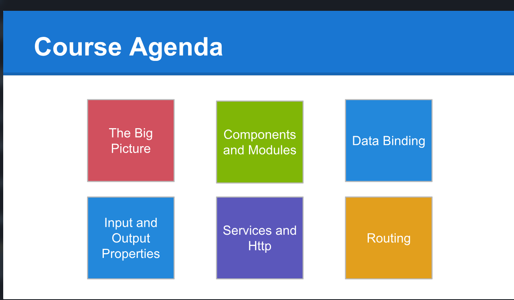
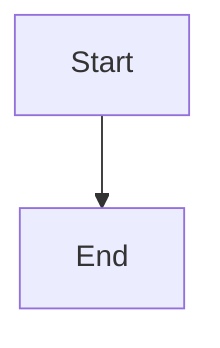

[read](https://scrimba.com/build-your-first-angular-app-c027)

Scrimba is an excellent learning platform that combines interactive interviews with video lessons, while also providing a built-in development environment where you can experiment with code.

Scrimba Provides a Free Course for Angular. 
Angular 5.0
Will create a dev container to set the environment with Angular 5 and a compatible NodeJS Version.

